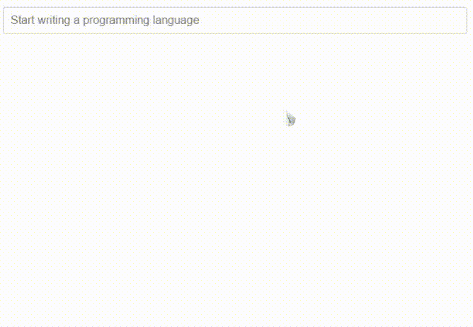

# vue3-simple-typeahead

[](https://www.npmjs.com/package/vue3-simple-typeahead)
[](https://v3.vuejs.org/)
[](https://en.wikipedia.org/wiki/MIT_License)
[](https://www.npmjs.com/package/vue3-simple-typeahead)
[](https://www.npmjs.com/package/vue3-simple-typeahead)

A Vue3 component for a simple typeahead component.
It will show a list of suggested items based on the user input.

The component includes it's own input and when the user types on it the suggested options appear.



## Demo

[Go to demo page](https://vue3-simple-typeahead-demo.netlify.app/)

[vue3-simple-typeahead-demo source code](https://github.com/frikinside/vue3-simple-typeahead-demo)

## Installation

### [NPM](https://www.npmjs.com/package/vue3-simple-typeahead)

```js
npm install vue3-simple-typeahead
```

### Browser

You can also use the browser bundle in a script tag.

```html
<script src="https://unpkg.com/vue3-simple-typeahead"></script>
```

## Add installed component to your app

Import the vue3-simple-typeahead component and register it globally in your Vue app. Import the CSS as well if you wish to use the default styling.

```js
import { createApp } from 'vue';
import App from './App.vue';
import SimpleTypeahead from 'vue3-simple-typeahead';
import 'vue3-simple-typeahead/dist/vue3-simple-typeahead.css'; //Optional default CSS

let app = createApp(App);
app.use(SimpleTypeahead);
app.mount('#app');
```

You can also import vue3-simple-typeahead locally in your component if you prefer.

```js
import SimpleTypeahead from 'vue3-simple-typeahead';
import 'vue3-simple-typeahead/dist/vue3-simple-typeahead.css'; //Optional default CSS

export default {
	name: 'my-vue-component',
	components: {
		SimpleTypeahead,
	},
};
```

## Usage

Use the component on your own app components

```html
<vue3-simple-typeahead
	id="typeahead_id"
	placeholder="Start writing..."
	:items="['One','Two','Three']"
	:minInputLength="1"
	:itemProjection="itemProjectionFunction"
	@selectItem="selectItemEventHandler"
	@onInput="onInputEventHandler"
	@onFocus="onFocusEventHandler"
	@onBlur="onBlurEventHandler"
>
</vue3-simple-typeahead>
```

With custom slots template

```html
<vue3-simple-typeahead
	id="typeahead_id"
	placeholder="Start writing..."
	:items="['One','Two','Three']"
	:minInputLength="1"
	:itemProjection="itemProjectionFunction"
	@selectItem="selectItemEventHandler"
	@onInput="onInputEventHandler"
	@onFocus="onFocusEventHandler"
	@onBlur="onBlurEventHandler"
>
	<template #list-header>
		LIST HEADER
	</template>
	<template #list-item-text="slot"><span v-html="slot.boldMatchText(slot.itemProjection(slot.item))"></span></template>
	<template #list-footer>
		LIST FOOTER
	</template>
</vue3-simple-typeahead>
```

### User interaction

When the user types on the typeahead input and the minimum input length is meeted a suggestion list appears below the input with the items that match the user input.
You can continue to type further to filter the selection, but you could use keyboard or mouse input to make your selection.abnf

When the suggestion list show up, you can continue to type to filter the selection or you use the `Arrow Up`<kbd>↑</kbd> or `Arrow Down`<kbd>↓</kbd> keys to navigate the list of suggestions. When you have selected the desired element press <kbd>Enter</kbd> or <kbd>TAB</kbd> to select the current element.

| Control          | Effect                                                             |
| :--------------- | :----------------------------------------------------------------- |
| <kbd>↑</kbd>     | Navigate up on the suggestion list, selecting the previous element |
| <kbd>↓</kbd>     | Navigate down on the suggestion list, selecting the next element   |
| <kbd>Enter</kbd> | Choose the current element selection                               |
| <kbd>TAB</kbd>   | Choose the current element selection (if `selectOnTab` is `true`)  |

You can use the mouse instead, simply hover you cursor over the desire element and click on it.


### Fallthrough attributes

All attributes added to the component not provided by props fallthrough the input control.
For example if you added the `disabled` attribute:

```html
<vue3-simple-typeahead
	id="typeahead_id"
	placeholder="Start writing..."
	:items="['One','Two','Three']"
	:minInputLength="1"
	:itemProjection="itemProjectionFunction"
	@selectItem="selectItemEventHandler"
	@onInput="onInputEventHandler"
	@onFocus="onFocusEventHandler"
	@onBlur="onBlurEventHandler"
	:disabled="disabled"
>
</vue3-simple-typeahead>
```

It would fallthrough to the input control of the component:

```html
<!---->
<input [...] :disabled="disabled" />
<!---->
```

### Props

| Prop                                | Type             | Default                    | Description                                                                                              |
| :---------------------------------- | :--------------- | :------------------------- | :------------------------------------------------------------------------------------------------------- |
| [`id`](#id)                         | String           | Random id generation       | The id for the input control. Can be useful to link with a `label for=""`                                |
| [`placeholder`](#placeholder)       | String           | `''`                       | Placeholder text for the input                                                                           |
| [`items`](#items)                   | Array (Required) |                            | List of objects or strings with the elements for suggestions                                             |
| [`defaultItem`](#defaultItem)       | Any              |                            | Default item to be selected                                                                              |
| [`minInputLength`](#minInputLength) | Number           | 2                          | Minimum input length for the suggestion length to appear, the prop value has to be >= 0                  |
| [`minItemLength`](#minItemLength)   | Number           | 0                          | Minimum number of items that need to be visible for suggestions to appear, the prop value has to be >= 0 |
| [`itemProjection`](#itemProjection) | Function: String | `(item) => {return item;}` | Projection function to map the items to a string value for search and display                            |
| [`selectOnTab`](#selectOnTab)       | Boolean          | `true`                     | Enable/Disable item selection on <kbd>TAB</kbd>                                                          |

_Remember you can always use lower-kebap-case for camelCase props like `min-input-length`_

### Events

| Event                       | Signature                                                        | Description                                                                                         |
| :-------------------------- | :--------------------------------------------------------------- | :-------------------------------------------------------------------------------------------------- |
| [`selectItem`](#selectItem) | `function (item: String): void`                                  | Emitted when the user selects an item from the suggestion list                                      |
| [`onInput`](#onInput)       | `function (event: Object { input: String, items: Array }): void` | Emitted when the user types anything                                                                |
| [`onFocus`](#onFocus)       | `function (event: Object { input: String, items: Array }): void` | Emitted when the input control get the focus                                                        |
| [`onBlur`](#onBlur)         | `function (event: Object { input: String, items: Array }): void` | Emitted when the input control lost the focus [When the user select an item, the focus is lost too] |

### Slots

| Slot                                 | Parent                                  | Props                                     | Description                                                     |
| :----------------------------------- | :-------------------------------------- | :---------------------------------------- | :-------------------------------------------------------------- |
| [`#list-header`](#list-header)       | `div.simple-typeahead-list-header`      |                                           | Slot to be show at top of the suggestion list                   |
| [`#list-item-text`](#list-item-text) | `span.simple-typeahead-list-item-text'` | `item`, `itemProjection`, `boldMatchText` | Slot to customize the text of every item in the suggestion list |
| [`#list-footer`](#list-footer)       | `div.simple-typeahead-list-footer`      |                                           | Slot to be show at bottom of the suggestion list                |

#### Slot `#list-item-text` props

| Prop                                | Type             | Description                                                                                                   |
| :---------------------------------- | :--------------- | :------------------------------------------------------------------------------------------------------------ |
| [`item`](#item)                     | String or Object | The item of the items array                                                                                   |
| [`itemProjection`](#itemProjection) | function         | Use the item projection function provided as prop to the `vue3-simple-typeahead` element                      |
| [`boldMatchText`](#boldMatchText)   | function         | A function that receives a string and add strong tags to the parts of the text matched by the search criteria |

### Methods

| Method                      | Signature                       | Description                                                      |
| :-------------------------- | :------------------------------ | :--------------------------------------------------------------- |
| [`clearInput`](#clearInput) | `function (): void`             | Clean the input with an empty string `''`                        |
| [`focusInput`](#focusInput) | `function (): void`             | Trigger focus on the input and called `onFocus` event handler    |
| [`blurInput`](#blurInput)   | `function (): void`             | Trigger blur on the input and called `onBlur` event handler      |
| [`getInput`](#getInput)     | `function (): HTMLInputElement` | Return the `HTMLInputElement` corresponding to the input control |

_This methods are accesible via [refs](https://vuejs.org/guide/essentials/template-refs.html)_

```html
<vue3-simple-typeahead ref="inputRef"> </vue3-simple-typeahead>
```

```javascript
{
	this.$refs.inputRef;
}
```

### Styling

Overwrite styles when using the default css included or add custom styles basing your rules on this structure.

```stylus
div#{:id}_wrapper.simple-typeahead
    input#{:id}.simple-typeahead-input
    div.simple-typeahead-list
        .simple-typeahead-list-header
        .simple-typeahead-list-item &.simple-typeahead-list-item-active
            .simple-typeahead-list-item-text
        .simple-typeahead-list-footer
```
